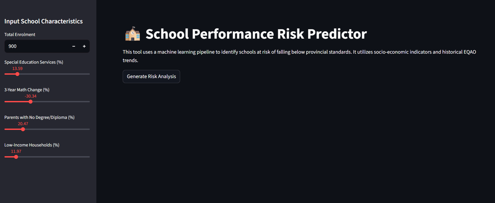

# EQAO Grade 6 Math Performance Prediction

## 📌 Project Overview
The **Education Quality and Accountability Office (EQAO)** is an Ontario-based organization that provides standardized testing for students in Grades 3, 6, and 9. This project focuses on **Grade 6 Mathematics** performance across Ontario schools.

### The Problem
Educational resources are finite. To support student outcomes effectively, the Ministry of Education needs to identify which schools are likely to struggle *before* the testing cycle begins.

### The Goal
The primary objective of this project is to use current academic data to predict if a school is **"High Risk"** for the following year. 
* **High Risk Definition:** A school where less than **50%** of the Grade 6 population achieves the Provincial mathematics standard.

---

## 🚀 Interactive Deployment
To make these predictions actionable, I developed a custom **Streamlit Dashboard**. This interface allows administrators to input school characteristics and receive a real-time risk assessment, complete with a natural language explanation of the key features driving the model's decision.

### Dashboard Features:
* **Predictive Engine:** Powered by an optimized Random Forest Pipeline including automated scaling and imputation.
* **Explainable AI:** Integrated **SHAP (Shapley Additive Explanations)** logic to translate complex model weights into clear, readable risk drivers.
* **Dynamic Inputs:** Sliders for socio-economic and performance metrics to test "What-If" scenarios and school profiles.

---

## 🏗️ Methodology & Classification
This is a **binary classification problem**. We engineered a target variable, `High Risk School`, where:
* **True (1.0):** Pass rate < 50%
* **False (0.0):** Pass rate ≥ 50%

### Machine Learning Algorithms Used
We evaluated four distinct models to determine which provided the most reliable predictions:

1. **Logistic Regression:** A baseline model used for its simplicity and clear relationship between input features and binary outcomes.
2. **K-Nearest Neighbours (kNN):** A proximity-based model that classifies schools based on the majority vote of the nearest "cluster" of data points.
3. **Random Forest Classifier:** An ensemble method that uses a large group of Decision Trees to prevent over-fitting and improve accuracy.
4. **XGBoost Classifier:** A gradient boosting framework that trains trees in a series, with each subsequent tree correcting the errors of the previous one.

> **Optimization Strategy:** Because missing a school that needs help (a False Negative) is more costly than over-identifying one, we prioritized the **Recall (True Positive Rate)** by adjusting the model's probability threshold.

---

## 📊 Model Performance Comparison

### Accuracy
While accuracy measures overall correctness, it was used here as a primary filter to rank model viability.

| Model | Accuracy Score |
| :--- | :--- |
| **Random Forest** | **0.693** |
| XGBoost | 0.682 |
| Logistic Regression | 0.678 |
| kNN Classifier | 0.617 |

### Detailed Classification Metrics
For this specific use case, we focused on the **True Positive Rate (TPR)** and **False Negative Rate (FNR)** to ensure we are capturing as many high-risk schools as possible.

| Metric | Random Forest | XGBoost | Logistic Regression |
| :--- | :--- | :--- | :--- |
| **True Positive Rate** | **0.739** | 0.727 | 0.639 |
| **False Negative Rate** | **0.342** | 0.355 | 0.386 |
| **Final Recall** | **0.684** | 0.672 | 0.623 |

### Key Contributing Features
The following 5 features were found to have the biggest impact on predicting 'At-Risk Schools':
1. Percentage of students receiving special education services
2. Total Enrolment
3. Percentage of students whose parents have no degree, diploma, or certificate
4. Percentage of school-aged children who live in low-income households
5. Most recent 3-year trend in EQAO scores

---

## 🏆 Final Results
The **Random Forest model** was the best-performing algorithm for this project. 

* **Predictive Power:** It correctly identifies high-risk schools **74%** of the time.
* **Impact:** By utilizing this model, the Ministry of Education can proactively allocate resources to the 74% of schools identified, significantly narrowing the gap in provincial mathematics standards.

---

## ✍️ Author
**Rossini Martyr** 
